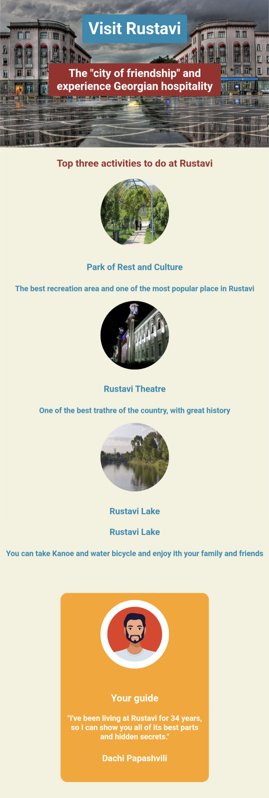

# Scrimba - Responsive Web Design Project - Build a product splash page

[Scrimba](https://scrimba.com/allcourses) Scrimba is the next-generation platform for learning how to code. Our screencasts enable you to interact with the code directly in the player. This way, you'll have more fun and learn faster. Our courses subjects like HTML, CSS, JavaScript, React, Vue, Angular, and more.

**To do this project you need a basic understanding of HTML and CSS and principles of responsive web design.**

## Deploying your project

There are many ways for hosting project for free. Best recommend hosts are:

- [GitHub Pages](https://pages.github.com/)
- [Netlify](https://www.netlify.com/)

## Table of contents

- [Overview](#overview)
  - [Screenshot](#screenshot)
  - [Links](#links)
- [My process](#my-process)
  - [Built with](#built-with)
  - [What I learned](#what-i-learned)
  - [Continued development](#continued-development)
  - [Useful resources](#useful-resources)
- [Author](#author)
- [Acknowledgments](#acknowledgments)

## Overview

### Screenshot
Mobile Responsive Version

### Links

- Solution URL: [Solution URL](https://github.com/Dachi-Papashvili88/hometown-homepage)
- Live Site URL: [live site URL](https://dachi-papashvili88.github.io/hometown-homepage/)

## My process

### Built with

- Semantic HTML5 markup
- CSS custom properties
- Flexbox
- Mobile-first workflow
- Viewport units
- Box sizing

### Useful resources

- [MDN](https://developer.mozilla.org/en-US/) 

- [W3schools](https://www.w3schools.com/) 

## Author

- Website - [Dachi Papashvili](https://github.com/Dachi-Papashvili88)
- Scrimba - [Scrimba](https://scrimba.com/allcourses)
- Linkedin - [Linkedin](https://www.linkedin.com/feed/)

## Acknowledgments

A very special thanks to Scrimba and its founder Per Harald Borgen for for such an interesting and engaging learning opportunity 